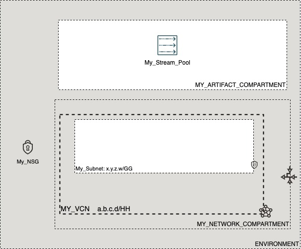

# OCI Cloud Bricks: Streaming Pool

[](https://img.shields.io/badge/license-UPL-green) [](https://sonarcloud.io/dashboard?id=oracle-devrel_terraform-oci-cloudbricks-streams-pool)

## Introduction
The following cloud brick enables you to create a streams pool insice OCI

## Reference Architecture
The following is the reference architecture associated to this brick


### Prerequisites
- Pre-existent VCN and Compartment Structure
- Pre-existent NSG (if required)

---
## Sample tfvar file

```shell
########## SAMPLE TFVAR FILE ##########
########## PROVIDER SPECIFIC VARIABLES ##########
region           = "foo-region-1"
tenancy_ocid     = "ocid1.tenancy.oc1..abcdefg"
user_ocid        = "ocid1.user.oc1..aaaaaaabcdefg"
fingerprint      = "fo:oo:ba:ar:ba:ar"
private_key_path = "/absolute/path/to/api/key/your_api_key.pem"
########## PROVIDER SPECIFIC VARIABLES ##########
########## ARTIFACT SPECIFIC VARIABLES ##########
stream_pool_display_name               = "My_Stream_Pool"
streams_pool_instance_compartment_name = "MY_ARTIFACT_COMPARTMENT"
streams_pool_network_compartment_name  = "MY_NETWORK_COMPARTMENT"
vcn_display_name                       = "MY_VCN"
network_subnet_name                    = "My_Subnet"
streams_pool_nsg_name                  = "My_NSG"
auto_create_topics_enable              = true
spool_log_retention_hours              = "24"
spool_num_partitions                   = "1"
########## ARTIFACT SPECIFIC VARIABLES ##########
########## SAMPLE TFVAR FILE ##########


```

### Variable specific considerations
- If NSG is required, provide the name of a pre-created one under variable `streams_pool_nsg_name`. In any other case, drop the usage of this variable from configuration or pass it on as `""`

## Sample provider
The following is the base provider definition to be used with this module

```shell
terraform {
  required_version = ">= 0.13.5"
}
provider "oci" {
  region       = var.region
  tenancy_ocid = var.tenancy_ocid
  user_ocid        = var.user_ocid
  fingerprint      = var.fingerprint
  private_key_path = var.private_key_path
  disable_auto_retries = "true"
}

provider "oci" {
  alias        = "home"
  region       = data.oci_identity_region_subscriptions.home_region_subscriptions.region_subscriptions[0].region_name
  tenancy_ocid = var.tenancy_ocid  
  user_ocid        = var.user_ocid
  fingerprint      = var.fingerprint
  private_key_path = var.private_key_path
  disable_auto_retries = "true"
}
```
---

## Variable documentation
## Requirements

| Name | Version |
|------|---------|
| <a name="requirement_terraform"></a> [terraform](#requirement\_terraform) | >= 0.13.5 |

## Providers

| Name | Version |
|------|---------|
| <a name="provider_oci"></a> [oci](#provider\_oci) | 4.40.0 |

## Modules

No modules.

## Resources

| Name | Type |
|------|------|
| [oci_streaming_stream_pool.StreamingPool](https://registry.terraform.io/providers/hashicorp/oci/latest/docs/resources/streaming_stream_pool) | resource |
| [oci_core_network_security_groups.NSG](https://registry.terraform.io/providers/hashicorp/oci/latest/docs/data-sources/core_network_security_groups) | data source |
| [oci_core_subnets.SUBNET](https://registry.terraform.io/providers/hashicorp/oci/latest/docs/data-sources/core_subnets) | data source |
| [oci_core_vcns.VCN](https://registry.terraform.io/providers/hashicorp/oci/latest/docs/data-sources/core_vcns) | data source |
| [oci_identity_compartments.COMPARTMENTS](https://registry.terraform.io/providers/hashicorp/oci/latest/docs/data-sources/identity_compartments) | data source |
| [oci_identity_compartments.NWCOMPARTMENTS](https://registry.terraform.io/providers/hashicorp/oci/latest/docs/data-sources/identity_compartments) | data source |

## Inputs

| Name | Description | Type | Default | Required |
|------|-------------|------|---------|:--------:|
| <a name="input_auto_create_topics_enable"></a> [auto\_create\_topics\_enable](#input\_auto\_create\_topics\_enable) | Enable auto creation of topic on the server. | `bool` | `true` | no |
| <a name="input_fingerprint"></a> [fingerprint](#input\_fingerprint) | API Key Fingerprint for user\_ocid derived from public API Key imported in OCI User config | `any` | n/a | yes |
| <a name="input_network_subnet_name"></a> [network\_subnet\_name](#input\_network\_subnet\_name) | Subnet where artifact is created | `any` | n/a | yes |
| <a name="input_private_key_path"></a> [private\_key\_path](#input\_private\_key\_path) | Private Key Absolute path location where terraform is executed | `any` | n/a | yes |
| <a name="input_region"></a> [region](#input\_region) | Target region where artifacts are going to be created | `any` | n/a | yes |
| <a name="input_spool_log_retention_hours"></a> [spool\_log\_retention\_hours](#input\_spool\_log\_retention\_hours) | The number of hours to keep a log file before deleting it (in hours) | `string` | `"24"` | no |
| <a name="input_spool_num_partitions"></a> [spool\_num\_partitions](#input\_spool\_num\_partitions) | The default number of log partitions per topic. | `string` | `"1"` | no |
| <a name="input_stream_pool_display_name"></a> [stream\_pool\_display\_name](#input\_stream\_pool\_display\_name) | Display name of Stream Pool | `any` | n/a | yes |
| <a name="input_streams_pool_instance_compartment_name"></a> [streams\_pool\_instance\_compartment\_name](#input\_streams\_pool\_instance\_compartment\_name) | Compartment where artifact is created | `any` | n/a | yes |
| <a name="input_streams_pool_network_compartment_name"></a> [streams\_pool\_network\_compartment\_name](#input\_streams\_pool\_network\_compartment\_name) | Compartment where VCN is located at | `any` | n/a | yes |
| <a name="input_streams_pool_nsg_name"></a> [streams\_pool\_nsg\_name](#input\_streams\_pool\_nsg\_name) | NSG Display name of associated NSG | `string` | `""` | no |
| <a name="input_tenancy_ocid"></a> [tenancy\_ocid](#input\_tenancy\_ocid) | OCID of tenancy | `any` | n/a | yes |
| <a name="input_user_ocid"></a> [user\_ocid](#input\_user\_ocid) | User OCID in tenancy. | `any` | n/a | yes |
| <a name="input_vcn_display_name"></a> [vcn\_display\_name](#input\_vcn\_display\_name) | Display name of VCN | `any` | n/a | yes |

## Outputs

| Name | Description |
|------|-------------|
| <a name="output_streampool"></a> [streampool](#output\_streampool) | StreamPool Object |

## Contributing
This project is open source.  Please submit your contributions by forking this repository and submitting a pull request!  Oracle appreciates any contributions that are made by the open source community.

## License
Copyright (c) 2021 Oracle and/or its affiliates.

Licensed under the Universal Permissive License (UPL), Version 1.0.

See [LICENSE](LICENSE) for more details.
